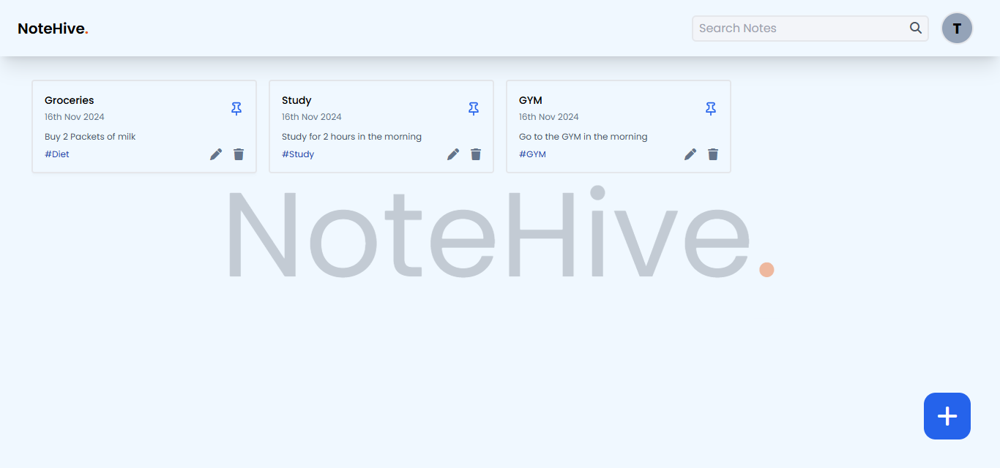

# NoteHive

NoteHive is a full-stack PERN (PostgreSQL, Express, React, Node.js) application designed for efficient note-taking. It features a modern UI and powerful functionalities, including user authentication, note pinning, editing, deleting, and searching.

---

## Features

- **User Authentication:** Secure login and signup using JSON Web Tokens (JWT) and bcrypt.
- **Create Notes:** Add and manage notes with ease.
- **Pin Notes:** Keep important notes easily accessible by pinning them.
- **Edit Notes:** Update note content directly.
- **Delete Notes:** Remove unwanted notes.
- **Search Notes:** Quickly find notes using the search bar.
- **Responsive Design:** Optimized for both desktop and mobile devices.

---

## Screenshots



---

## Tech Stack

- **Frontend:** React, Tailwind CSS, GSAP for animations
- **Backend:** Node.js, Express.js
- **Database:** PostgreSQL
- **Authentication:** bcrypt, JWT
- **Tools:** Nodemon, Git, dotenv, CORS

---

## Getting Started

Follow these steps to set up and run NoteHive locally.

### 1. Prerequisites

- Install [Node.js](https://nodejs.org/) and [npm](https://www.npmjs.com/get-npm).
- Install [PostgreSQL](https://www.postgresql.org/).

---

### 2. Clone the Repository

```bash
git clone https://github.com/your-username/notehive.git
cd notehive
