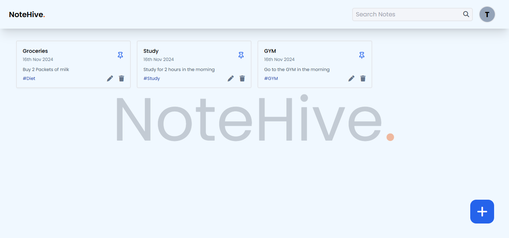

# NoteHive

NoteHive a note taking web application made using PERN (PostgreSql, Express, React, NodeJs) stack technologies. NoteHive allows users to create, edit, delete and pin note.
It also comprises of various features like authentication and seemless UI makign it efficient and effective.

## Features
- Implements authentication seemlessly
- Add, Edit, Delete of note
- Modern UI
- Allows users to Pin their Note
- Search bar allowing user to search their note
